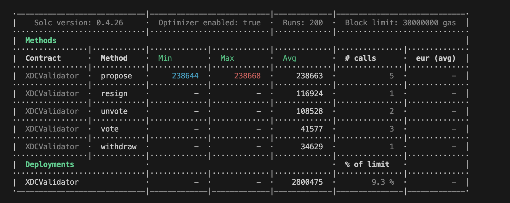

# XDC Validator Contract

This folder has provided scripts for:

- Contract Building and Testing
- Contract Deployment

## Contract Building and Testing:

Environmental preparation

###### Nodejs 16 or higher version

Install dependencies

```shell
yarn
```

Test

```shell
npx hardhat compile
npx hardhat test
```

## Deploy contract to node genesis block

1. run generate script to genera

```shell
node scripts/deployToGenesis.js
```

2. run

```shell
./abigen --abi abi --bin bytecode --pkg contract --type XDCValidator --out ../contract/validator.go
```

If you don't have `abigen`, compile it. It's in `cmd/abigen/main.go` in XDC main repo (or Geth repo). and run `go build`

3. Go `../contract/validator.go` change `github.com/ethereum/go-ethereum` to `ethereum "github.com/XinFinOrg/XDC-Subnet"`

## Deploy contract to node any block

### Contract Setup:

This step is recommended to complete in python virtual environment because it is going to use the web3 library adapted for XDC. And before running the process, it is required to performed two operations:

1. Fill in the fields in `deployment.json`

   - `candidates`: Initial candidates
   - `caps`: Initial caps, one cap for one candidate
   - `firstOwner`: Owner of initial candidates
   - `minCandidateCap`: Minimal value for a transaction to call propose()
   - `minVoterCap`: Minimal value for a transaction to call vote()
   - `maxValidatorNumber`: Never used, I don't know why XDC people write this...
   - `candidateWithdrawDelay`: When you call resign() at block number x, you can only withdraw the cap at block x+candidateWithdrawDelay
   - `voterWithdrawDelay`: When you call unvote() at block number x, you can only withdraw the cap at block x+voterWithdrawDelay
   - `grandMasters`: List of grand masters
   - `minCandidateNum`: min candidate num
   - `xdcdevnet`: Targeted XDC public chain devnet, testnet or mainnet node RPC link
   - `xdcsubnet`: Targeted XDC private subnet chain devnet, testnet or mainnet node RPC link

2. Create a `.env` file which contain a valid account privatekey, check `.env.sample` for example

### Contract Deployment:

And get the deployed contract address

```shell
npx hardhat run scripts/deployment.js --network xdcdevnet
```

## Other command

```shell
npx hardhat accounts
npx hardhat compile
npx hardhat clean
npx hardhat test
npx hardhat node
npx hardhat help
REPORT_GAS=true npx hardhat test
npx prettier '**/*.{js,json,sol,md}' --check
npx prettier '**/*.{js,json,sol,md}' --write
npx solhint 'contracts/**/*.sol'
npx solhint 'contracts/**/*.sol' --fix
```

## Gas report


