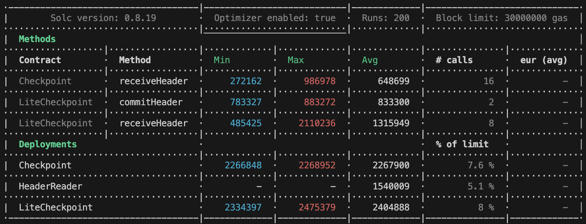

# XDC Subnet Contract

This folder has provided scripts for:

- Contract Building and Testing
- Contract Deployment

## Contract Building and Testing:

Environmental preparation

###### Nodejs 16 or higher version

Install dependencies

```shell
yarn
```

Test

```shell
npx hardhat compile
npx hardhat test
```

## Contract Setup:

This step is recommended to complete in python virtual environment because it is going to use the web3 library adapted for XDC. And before running the process, it is required to performed two operations:

1. Fill in the fields in `deployment.json`

   - `validators`: List of initial validator addresses
   - `gap`: GAP block number on public chain
   - `epoch`: EPOCH block number on public chain
   - `xdcparentnet`: Targeted XDC public chain devnet, testnet or mainnet node RPC link
   - `xdcsubnet`: Targeted XDC private subnet chain devnet, testnet or mainnet node RPC link

2. Create a `.env` file which contain a valid account privatekey, check `.env.sample` for example

## Contract Deployment:

And get the deployed contract address

Checkpoint

```shell
npx hardhat run scripts/checkpointDeploy.js --network xdcparentnet
```

Lite checkpoint

```shell
npx hardhat run scripts/liteCheckpointDeploy.js --network xdcparentnet
```

## Other command

```shell
npx hardhat accounts
npx hardhat compile
npx hardhat clean
npx hardhat test
npx hardhat node
npx hardhat help
REPORT_GAS=true npx hardhat test
npx prettier '**/*.{json,sol,md}' --check
npx prettier '**/*.{json,sol,md}' --write
npx solhint 'contracts/**/*.sol'
npx solhint 'contracts/**/*.sol' --fix
```

## Gas report


